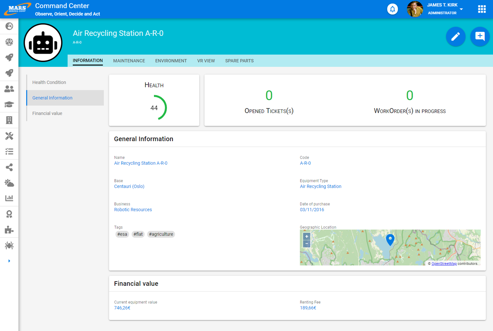
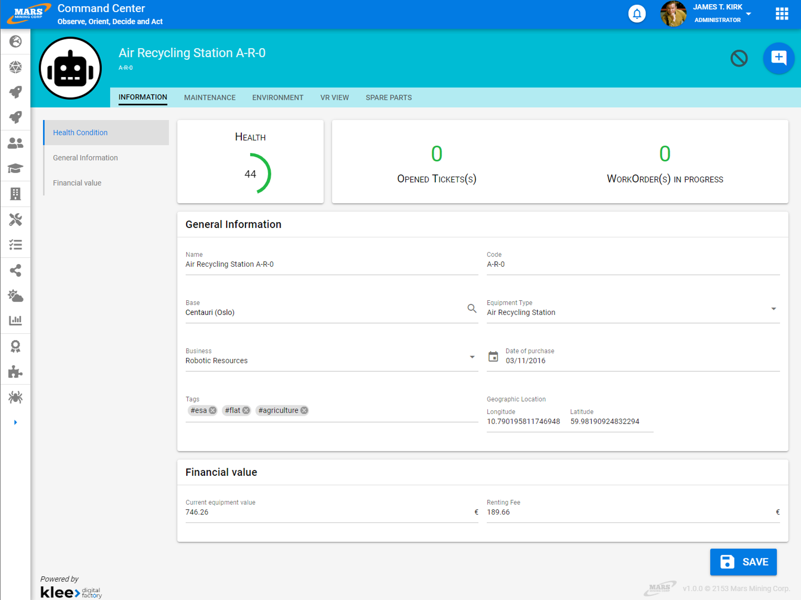

# Edition/Consultation

Les molécules de vertigo supportent toutes deux modes de rendu : le mode édition et le mode consultation.

Cela signafie qu'il est très aisé de conserver une grande cohérence entre ces deux types d'écrans. Cela permet un parcours extrèmement fluide pour un utilisateur car l'information qu'il voit à un endroit sera modifiable au même endroit.
D'autre part c'est un véritable levier d'efficacité pour les écrans typiques qui permet dans le cadre d'un projet d'apporter un soin tout particulier aux écrans et fonctionnalités qui font sa spécificité.

Ainsi nous privilégions un template de page qui tire pleinement profit de ce principe.

Une page d'édition consultation est alors composé :

-  d'un header comprenant : 

	- un visuel optionnel à gauche
	- une description succinte d'éléments qu'il est important d'avoir à disposition quel que soit l'onglet actif
	- une liste d'onglet lorsqu'il y en a plusieurs
	- une liste d'action : dont l'action "Modifier" qui permet de passer l'écran en édition lorsque l'on est en mode consultation et "Annuler" pour retourner en mode consultation lorsque l'on est en mode édition
- d'une zone de travail qui contient :

	- un "scrollspy" ou ancre dynamique pour un accès rapide si la page contient entre 5 et 7 blocs
	- une zone de travail la plus grande possible
	- un bouton flottant "Sauver" en bas à droite lorsque l'on est en mode édition qui permet de sauvegarder les informations modifiées et retourner en mode consultation. Ce bouton étant flottant il sera toujours visible et cliquable quelle que soit la position de l'utilisateur sur la page

# Bonnes pratiques

- Les informations contenues dans le header (hors actions) doivent idéalement être identiques pour tous les onglets d'un même concept
- Une page ne doit pas contenir plus de 7 blocs : au délà préférez la découper en onglet
- Le header doit etre minifiée au scroll afin de conserver un espace de travail conséquent pour l'utilisateur
- Ne placez jamais un autre élément au dessus du bouton flottant "Sauver"
- Désactivez le scrollspy sur des écrans de taille moyenne et petite afin de maximiser l'espace de travail

# Design

## Consultation
 

## Edition
 